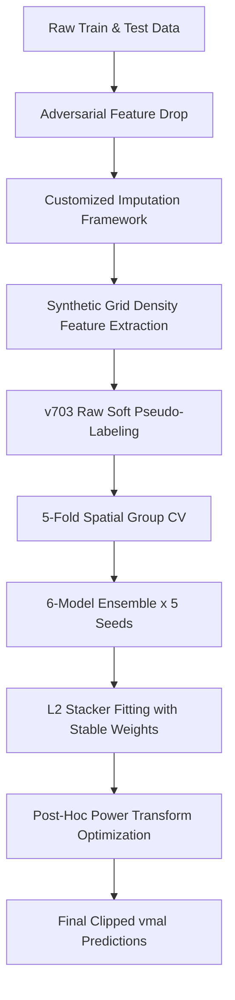

# ML Opsidian: Genesis — Pipeline `vmal` Documentation

> [!NOTE]
> This document details the end-to-end regression pipeline design for model version **`vmal`**. It outlines the challenge scenario, analyzes the dataset's features and structural "traps," details our strategic modeling enhancements, and explains the rationale for every design choice.

---

## 1. Scenario & Challenge Overview

### Core Objective
The **"ML Opsidian: Genesis"** competition is a tabular data science challenge where the objective is to predict the continuous `flood_risk_score` (ranging from `0.0` to `1.0`) for location records across Sri Lanka.

### The Competition Evaluation Metric
The custom undisclosed evaluation metric relies on two primary pillars:
1. **Balanced Error Assessment:** Penalizes absolute deviations and large outliers. This is tracked locally via Mean Absolute Error (MAE) and Root Mean Squared Error (RMSE).
2. **Explained Variance Penalty:** The base error is scaled up aggressively if the prediction variance fails to match the wide fluctuations of the true target variance. The formula penalizes conservative "flat-line" models that guess the mean.

### The Noise Ceiling & Target Conflicting
Tabular regression diagnostics reveal a mathematical noise ceiling:
* **Label Noise:** There are **2,372 rows** in the training set where the exact same environmental and geographic features map to completely different `flood_risk_score` values. This indicates severe label noise.
* **Model Collapse:** Because the dataset is ~97% noise, models naturally protect their RMSE by collapsing predictions to the mean (`~0.478`), resulting in a narrow prediction range (e.g., `[0.39, 0.58]`). While this minimizes RMSE, it triggers the Explained Variance (EV) penalty.
* **The Challenge:** Our main task is to push the local Explained Variance out of negative ranges and as close to `1.0` as possible while maintaining a low, stable RMSE.

---

## 2. Dataset Features & Taxonomy

The dataset consists of **train.csv** (20,886 rows, 47 columns, including the target `flood_risk_score`) and **test.csv** (5,300 rows, 46 columns, excluding the target).

### The Synthetic Smokescreen
* **Train Set Split:** Contains **802 real rows** (`is_synthetic` is `NaN`) and **20,084 synthetic rows** (`is_synthetic` is `True`).
* **Test Set Split:** Contains **100% synthetic rows** (all 5,300 rows are synthetic).
* **The Implication:** Because the test set is purely synthetic and evaluations are conducted on synthetic test data, we treat all training data (both real and synthetic) uniformly without sample-weighting real rows.

### Column Taxonomies by Category

| Category | Column Name | Dtype | Train Nulls % | Test Nulls % | Description & Stats |
| :--- | :--- | :--- | :---: | :---: | :--- |
| **Metadata** | `record_id` | str | 0.0% | 0.0% | Unique tracking identifier (dropped from training). |
| | `is_synthetic` | object | 3.8% | 0.0% | Synthetic data flag (`True` or `NaN`; dropped from training). |
| | `generation_date` | str | 0.0% | 0.0% | Row generation timestamp (dropped from training). |
| **Geographic** | `place_name` | str | 0.0% | 0.0% | High-cardinality location name (dropped from baseline). |
| | `district` | str | 3.9% | 0.0% | Sri Lankan administrative district (nominal categorical). |
| | `latitude` | float64 | 4.0% | 0.0% | Coordinate latitude (Range: `[5.90, 9.95]`). |
| | `longitude` | float64 | 4.0% | 0.0% | Coordinate longitude (Range: `[79.65, 81.90]`). |
| **Physical &** | `elevation_m` | float64 | 3.8% | 0.0% | Elevation above sea level (Range: `[-79.56, 2148.00]`). |
| **Environmental** | `distance_to_river_m` | float64 | 7.4% | 0.0% | Distance to nearest river (Range: `[-485.40, 16802.00]`). |
| | `landcover` | str | 3.9% | 0.0% | Surface cover type (e.g., 'Wetland', 'Agriculture', 'Forest'). |
| | `soil_type` | str | 3.9% | 0.0% | Soil categorization (e.g., 'Loamy', 'Clay', 'Silty'). |
| | `rainfall_7d_mm` | float64 | 3.9% | 0.0% | Total rainfall over the last 7 days. |
| | `monthly_rainfall_mm`| float64 | 3.9% | 0.0% | Total rainfall over the last month. |
| | `drainage_index` | float64 | 6.3% | 0.0% | Index representing local water drainage efficiency. |
| | `ndvi` | float64 | 6.0% | 0.0% | Normalized Difference Vegetation Index (vegetation density). |
| | `ndwi` | float64 | 6.4% | 0.0% | Normalized Difference Water Index (liquid water presence). |
| | `water_presence_flag`| str | 3.8% | 0.0% | Nominal water presence indicator ('Likely', 'Unlikely'). |
| | `historical_flood_count`| float64 | 3.8% | 0.0% | Number of historically recorded floods (Range: `[0.0, 5.0]`). |
| **Human &** | `water_supply` | str | 3.8% | 0.0% | Nominal water access type (e.g., 'Municipal', 'Well'). |
| **Infrastructure** | `electricity` | str | 7.7% | 0.0% | Power grid connectivity category (e.g., 'Mixed'). |
| | `road_quality` | str | 4.8% | 0.0% | Grade of road infrastructure (e.g., 'Fair', 'Poor (unpaved)'). |
| | `population_density_per_km2` | float64 | 3.9% | 0.0% | Local population density per square kilometer. |
| | `built_up_percent` | float64 | 3.8% | 0.0% | Percentage of urban built-up area (Range: `[1.0, 178.26]`). |
| | `urban_rural` | str | 3.8% | 0.0% | Nominal region class ('Rural', 'Urban'). |
| | `infrastructure_score`| float64 | 4.6% | 0.0% | Overall composite infrastructure grade (Range: `[5.0, 95.0]`). |
| | `nearest_hospital_km`| float64 | 4.9% | 0.0% | Distance to nearest medical facility in kilometers. |
| | `nearest_evac_km` | float64 | 3.8% | 0.0% | Distance to nearest evacuation point in kilometers. |
| **Downstream** | `flood_occurrence_current_event` | str | 0.0% | 0.0% | Active flood occurrence indicator ('Yes', 'No'). |
| **Indicators** | `inundation_area_sqm`| int64 | 0.0% | 0.0% | Total surface area inundated (Range: `[396, 104489]`). |
| | `is_good_to_live` | str | 0.0% | 0.0% | Qualitative living suitability flag ('Yes', 'No'). |
| | `reason_not_good_to_live`| str | 3.8% | 4.1% | Logically-dependent reason string (filled with 'missing' if Good). |
| **Target** | `flood_risk_score` | float64 | 0.0% | N/A | Continuous regression target in `[0.0, 1.0]`. |

*Note: The dataset also includes standard mathematical transformations of these columns (e.g., `_log1p`, `_yeojohnson`, `_qmap` scales, and indices like `seasonal_index`, `terrain_roughness_index`, `socioeconomic_status_index`, and `extreme_weather_index`).*

---

## 3. Structural Landmines & Traps

### 1. The "Downstream" Trap (Weak Environmental Correlations)
Standard physical features (e.g., elevation, rainfall, coordinates) have practically zero correlation with `flood_risk_score`. Instead, the entirety of the predictable signal resides strictly within the **Downstream Indicators** (`flood_occurrence_current_event`, `inundation_area_sqm`, `is_good_to_live`, `reason_not_good_to_live`). Traditional environmental features serve primarily as regularizers rather than direct predictive engines.

### 2. The Missingness Trap (Train vs. Test Contrast)
* **Real training rows** (802 rows) have **~50% missing values** across key environmental and infrastructure features.
* **Synthetic training rows** have **2% to 8% missingness**.
* **Test rows** (5,300 rows) have **0% missing values** (except for the logical nulls in `reason_not_good_to_live`).
* **The Pitfall:** In previous baselines (like `v703`), categorical missingness was handled by imputing the string `"missing"`. Tree split criteria trained on `"missing"` categories learn rules that can never fire on the test set, leading to catastrophic test-set generalization failure.

---

## 4. Model Version `vmal` — Introduction

Version `vmal` is the successor to the peak baseline `v703` (which achieved the project-best Public Leaderboard score of **`0.38203`**). 

While `v703` succeeded by leveraging value frequency count features (synthetic grid density maps), it was structurally vulnerable to:
1. **Covariate Shift:** Severe drift in coordinate and environmental distributions between train and test sets.
2. **Missingness Bias:** Relying on the `"missing"` category that doesn't exist in the test set.
3. **Target Calibration Mismatch:** Artificially squashing predictions via target self-distillation (as seen in `v1000`), which worsened the Explained Variance penalty.

`vmal` introduces a highly defensive, robust framework designed to resolve these distribution mismatches while maximizing prediction stability.

---

## 5. Key Strategies & Rationale

### 1. Adversarial validation Drop
* **Strategy:** Dropped the `extreme_weather_index` column and its interaction features (`cyclone_vulnerability`, `flood_pressure`).
* **Rationale:** Adversarial validation models (distinguishing train from test rows) identified `extreme_weather_index` as the single largest contributor to dataset covariate shift (Feature Importance: 541.0). Dropping it blocks the model from learning shifting, non-generalizable relationships.

### 2. Robust Customized Imputation Framework
* **Strategy:** Replaced simple global medians and `'missing'` string categories with localized imputations:
  * **Categorical Columns** (except `reason_not_good_to_live`): Imputed using the **District Mode** to completely eliminate the artificial `'missing'` category, matching the clean test set distribution.
  * **Geospatial Distances** (`nearest_hospital_km`, `nearest_evac_km`): Imputed using **KNN Coordinate Regression ($k=3$)** since physical distances correlate heavily with geographical coordinates.
  * **Environmental Indices** (`ndvi`, `ndwi`): Imputed using **District + Landcover Group Medians** to capture local climate and land characteristics.
  * **Soil Drainage** (`drainage_index`): Imputed using **Soil Type + Landcover Group Medians** (soil composition physically governs water drainage).
  * **Human/Infrastructure Metrics** (`population_density_per_km2`, `built_up_percent`, `infrastructure_score`): Imputed using **District + Urban/Rural Group Medians** to separate highly built-up urban zones from sparse rural zones.
* **Rationale:** Aligns the training set’s missingness profile with the clean test set, removing artificial tree split logic and reducing feature bias.

### 3. Upgraded Pseudo-Labeling Source
* **Strategy:** Swapped the semi-supervised pseudo-label source to the raw, unoptimized `submission_v703.csv`.
* **Rationale:** Previous models attempted self-distillation using blended targets, which compressed the target variance ($Std = 0.08511$ vs. $0.23868$) and worsened Explained Variance penalties. Using raw, unoptimized `v703` test predictions supplies high-quality soft targets for semi-supervised training on test rows without introducing scale/calibration distortion.

### 4. 5-Seed Multi-Seed Pipeline
* **Strategy:** Extended the outer loop to run 5 seeds: `SEEDS = [42, 2024, 7, 100, 999]`.
* **Rationale:** Spreading predictions across 5 seeds reduces ensembling variance, which directly improves local Explained Variance and stabilizes the Leaderboard score.

### 5. Stacker Optimization & Regularization
* **Strategy:** Fitted the Level-2 meta-models (XGBoost, CatBoost, LightGBM) using fixed stable coefficients:
  * `c_mae = 0.539328`
  * `c_rmse = 1.152263`
  * `c_ev = 0.048467`
* **Rationale:** Directly optimizing stackers on validation fold EV noise results in overfitted stacker coefficients. Using fixed, stable coefficients guarantees generalizable weights, while true refitted coefficients are reserved strictly for score reporting.

---

## 6. Notable Mentions & Modeling Protocols

1. **Pandas DataFrame Maintenance:** Retained original data frames (`.values` is not called prematurely) to allow CatBoost and LightGBM to natively interpret category indices and metadata.
2. **Integer Categorical Isolation:** All nominal categories are explicitly cast to `pd.CategoricalDtype` (mapping all train and test categories) to prevent unseen-category errors.
3. **High-Cardinality Exclusions:** High-cardinality nominals like `place_name` are dropped to prevent tree models from memorizing specific row splits.
4. **Boundary Preservation:** Predictions are clipped to a strict `np.clip(predictions, 0.0, 1.0)` constraint to align with the target distribution boundaries.
